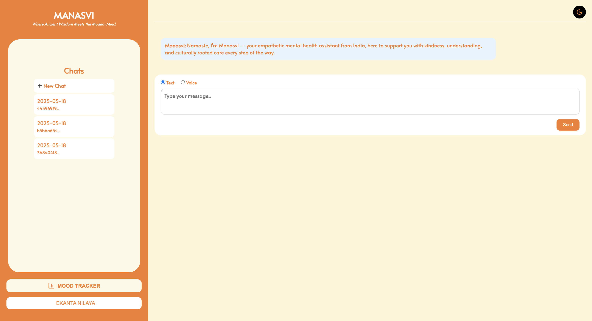

# 🧘‍♀️ Manasvi – Your Indian Mental Wellness Companion 🇮🇳💬🌿

**Manasvi** (मनस्वी) is an AI-powered mental wellness chatbot built especially for Indian users. Whether you're feeling stressed, anxious, or just need a break — Manasvi is here to chat, guide you through **Pranayama breathing techniques**, suggest **yoga asanas**, track your mood, and help you meditate with soothing Indian melodies.

---

## 🇮🇳 India-Focused Wellness Features

- 🙏 **Yoga & Pranayama Guidance**: Get personalized suggestions for breathing techniques like *Anulom Vilom* and *Bhramari*, or asanas like *Balasana* and *Shavasana*.
- 🎶 **Indian Calming Music**: Meditate with gentle sitar, flute, or rain ragas.

---

## 🌼 Why Manasvi?

- Named after the Sanskrit word *Manasvi*, meaning “of pure mind” 🕊️
- Brings ancient Indian wellness practices to modern tech interfaces
- Empowers mental health with AI, not stigma

---

## 🚀 Features

- 💬 **AI Chatbot**: Chat via text or voice using an Azure GPT-4-powered assistant.
- 🎤 **Voice to Text**: Speak your thoughts — OpenAI Whisper will convert them to text.
- 📈 **Mood Tracker**: Record how you're feeling and view progress over time with interactive Plotly graphs.
- 🧘 **Meditation Corner**: Play calming music and set a timer to relax your mind.
- 🔐 **User Login System**: Secure signup/login so your data stays yours.
- 🔒 **Data Isolation**: Each user’s data is stored separately and securely.

---

## 🛠️ Tech Stack

| Layer           | Technology Used                                       |
|----------------|--------------------------------------------------------|
| 💻 Frontend     | HTML and CSS                                           |
| 🧠 Chatbot      | GROQ API                                               |
| 🎙️ Voice Input  | [OpenAI Whisper](https://openai.com/research/whisper)  |
| 📊 Graphs       | Chart.js                                              |
| 🗄️ Database     | SQLite (with user data isolation)                     |
| 🔐 Auth         | Python + `bcrypt` for password hashing                |

---

## Snapshots

